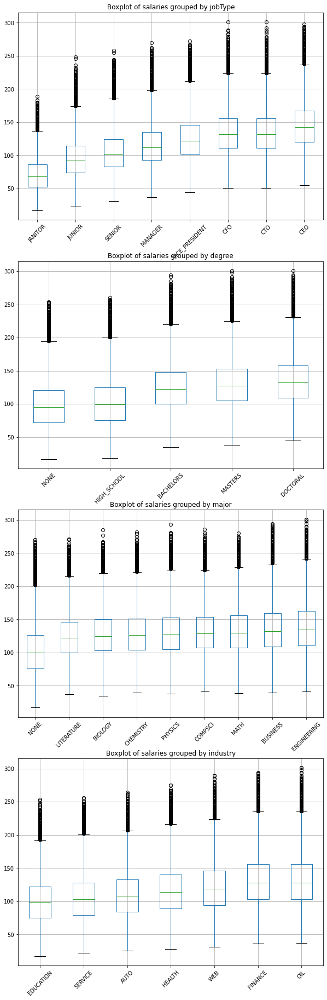
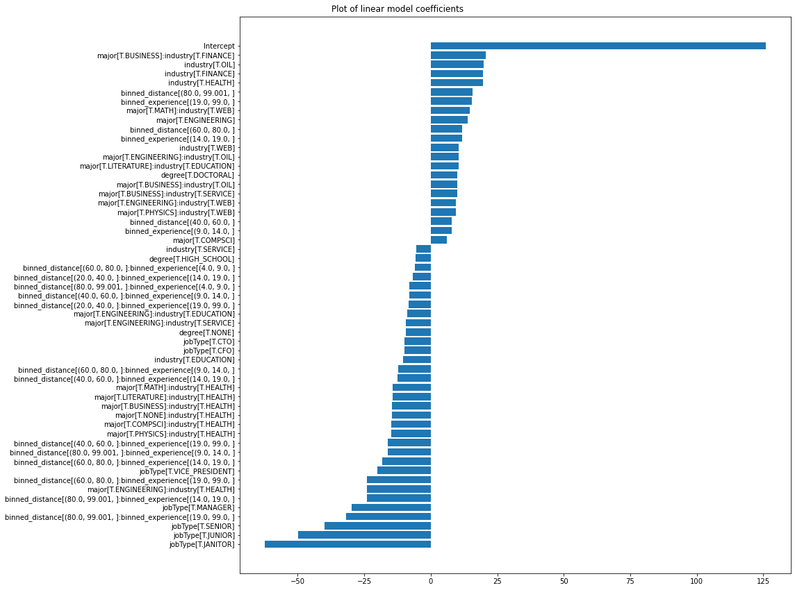

# Salary Predictions based on job descriptions

### Project overview:

In this project, we predict salaries based on job descriptions. Given a table containing 1M jobs with several criteria, including job type, years of experience required, distance from metropolis, company ID, degree required, and major required, and the corresponding salaries, we build a prediction model to predict the salaries of another 1M jobs in a test set. **Through feature engineering, we are able to build a linear regression model that has a lower MSE than XGBoost**.

The accuracy of the predictions is evaluated through the splitting of training data into a training and validation set. **The final chosen model**, a **linear model** which includes additional **features engineered** after **residual analysis**, has a **Mean Squared Error of 355** on the validation set. Since no salaries are provided for the test set, we estimate that the error on the test set predictions are similar. We can be highly confident in the **robustness** of our model, as its **accuracy** is the **same on the validation set as on the training set**. Furthermore, we know that **the model is not underfitting**, as the analysis of residuals shows that they do not correlate significantly with any predictor or combination of predictors.

The results of the linear model are compared to those of a more complex algorithm, XGBoost. This algorithm fails to perform better than the linear model, which shows that **all meaningful interactions** between variables have been properly captured in feature engineering.

This project was done in Python, using the  following libraries: numpy, pandas, patsy, statsmodels, sci-kit learn and XGBoost. The project contains the following notebooks:  

- [1_Salary_Prediction_Data_Cleaning_EDA.ipynb](https://github.com/nicsaunier/Salary_prediction_project/blob/master/1_Salary_Prediction_Data_Cleaning_EDA.ipynb)
- [2_Salary_Predictions_Model_Development_Deployment_Interpretation.ipynb](https://github.com/nicsaunier/Salary_prediction_project/blob/master/2_Salary_Predictions_Model_Development_Deployment_Interpretation.ipynb)

In addition, two python files with helper functions are provided:
- [Salary_pred_EDA_helpers.py](https://github.com/nicsaunier/Salary_prediction_project/blob/master/Salary_pred_EDA_helpers.py)
- [Salary_pred_model_helpers.py](https://github.com/nicsaunier/Salary_prediction_project/blob/master/Salary_pred_model_helpers.py)

### Data Cleaning

The data was very clean to begin with, only a few rows for which the salary was 0 were removed. There were no duplicates, and no extreme outliers that felt like they needed to be removed: the highest salaries, which were out of the interquartile range, were for c-suite positions in the sectors that paid the most money.

### Exploration

All of the variables in the data set were explored and their relationship with the dependent variable was measured. For categorical variables, the relationship between the value of these variables are best viewed with the boxplots below:

### Algorithmic methods: 

Two algorithmic methods were used for this exercise: linear regression and XGBoost. Note that in a first version of the project, Random Forest and sklearn's HistGradientBoosting had been used instead, however that version of the project contained an error due to data leakage. HistGradientBoosting had been found to have a lower mean squared error than random forest in that first version, which is why XGBoost was chosen in this version as the model of reference with which to compare predictions from linear regression. 

#### How the algorithmic methods work:

Linear regression simply predicts the dependent variable as a linear function of independent predictors. Categorical variables such as job type need to be encoded through one-hot encoding in order for a linear model to incorporate them properly in its predictions. Multivariate linear regression fits a line in an x-dimensional space, where x is the number of features used, and tests various coefficients for each feature in order to minimize the sum of squared errors between the predictions in the training set and the actual value of the predicted variable.

XGBoost is an ensemble tree method derived from gradient boosting. XGBoost makes an initial prediction and calculates the residuals of this prediction. Then, a similarity score is calculated for these residuals, and different splits are tried to see which split in the data results in maximum gain, i.e. maximum difference between similarity scores after the split and before the split. Once a tree is built, new predictions can then be made for each data point: these predictions are a combination of previous predictions and outputs of the tree multiplied by a learning rate which the user defines. XGBoost will continue building trees based on the residuals of its predictions until it has reached the maximum number of trees specified by the user, or, if early stopping is enabled, until the error in predictions of the validation set has not been reduced when including adjustments based on the last x trees (another hyperparameter). XGBoost also includes several algorithmic optimizations which make it work much faster than traditional gradient boosting, such as classifying the data into bins before trying splits or using cache memory optimally.

### Special Features Engineered

In this project, in order to maximize the accuracy of the predictions which can be obtained from linear regression, combinations of features are encoded into additional predictor variables. The features that need to be combined are found through analysis of residuals and grouping of predictions with the help of a custom built function, see the second notebook on model development for more details.
The most significant interactions between variables are the ones between major and industry and the ones between distance and experience. For major and industry, there are few enough combinations to be able to create a dummy variable for each one, whereas for distance and experience, variables are binned into quantiles before being combined.

### Features that had the greatest impact on salary

Job Type is the most impactful feature, with CEOs earning, all other things remaining equal, over 60k dollars more than Janitors and almost 50k dollars more than Junior staff. 
More surprising things include distance and experience having a strange relation: in general, salaries increase with the years of experience required and decrease as jobs get further from the metropolis. However, the added value of experience is also greatly decreased when jobs are far away from big cities.
Some industries pay better than others (oil and finance have high salaries), but some combinations of majors and industries also have very significant interactions. Jobs in the health sector, for example, generally pay more than average but pay less when the major is not relevant, whereas for jobs in the finance industry, a major in business has a double beneficial effect. 

### Additional work done as part of this  project and lessons learned:

As stated above, this is the second version of this project. The first version of this project contained additional features, which were obtained through grouping of the database by categorical variables such as company, job type, degree, etc and calculating statistics based on these categories, such as the mean, the 20% and 80% percentiles, the standard deviation, the min and max... The error was that these statistics were originally  calculated on all of the data, before cross-validation. This gave the false impression that the MSE had been reduced to approximately 313 with gradient boosting. Unfortunately, the results were not valid, as the statistics should only have been calculated on the fold of the data that was used for training the model, otherwise the reduction of the mean squared error was due to data leakage: basically, looking at the results of the validation set before fitting the model. When the proper procedure of splitting the data before computing the statistics was used, these additional features were found to lead to overfitting, and were removed from the model.

